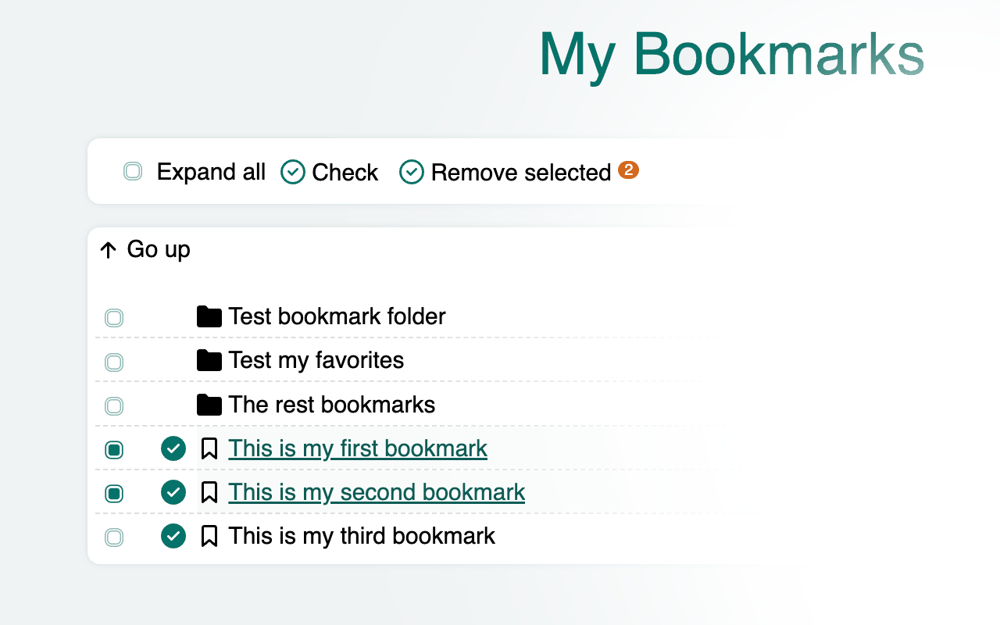

My-Bookmarks - manage your old bookmarks ...

## Overview:

It is a useful application that checks all bookmarks in the browser for outdated items. \
All obsolete bookmarks that have been selected could be removed at once. \
Please pay attention that even if this app selects a bookmark to be deleted, a website, this bookmark links to, could be temporarily unavailable, so please check each action manually before deleting.

This extension is published to the google webstore: https://chromewebstore.google.com/detail/my-bookmarks/kkihmoboffpfmcdpcpgobjodhcjfjjlp

2024 My-Notes.
